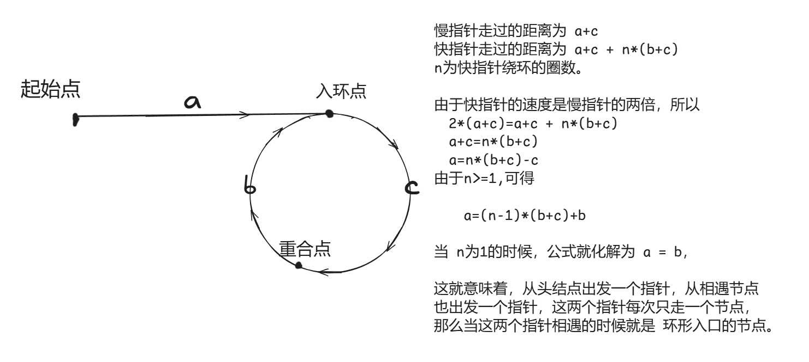

## 24.两两交换链表中的节点
- **题目：给你一个链表，两两交换其中相邻的节点，并返回交换后链表的头节点。**
    
    **你必须在不修改节点内部的值的情况下完成本题（即，只能进行节点交换）。**
    1. ### 单指针正常模拟
        ```csharp
        public ListNode SwapPairs(ListNode head)
        {
            ListNode dummyhead = new ListNode();
            dummyhead.next = head; 

            ListNode cur = dummyhead;
            ListNode tmp1,tmp2;
            while (cur.next != null&&cur.next.next!=null) 
            {
                tmp1 = cur.next;
                tmp2 = cur.next.next;
                cur.next = tmp2;
                tmp1.next = tmp2.next;
                tmp2.next = tmp1;

                cur=cur.next.next;

            }

            return dummyhead.next;
        }
        ``` 


## 19. 删除链表的倒数第 N 个结点
- **题目：给你一个链表，删除链表的倒数第 n 个结点，并且返回链表的头结点。**
    1. ### 双指针法
        
        **双指针的经典应用，如果要删除倒数第n个节点，让fast移动n步，**
        
        **然后让fast和slow同时移动，直到fast指向链表末尾。删掉slow所指向的节点就可以了。**
        ```csharp
        public ListNode RemoveNthFromEnd(ListNode head, int n) 
        {
            //注意边界判断和操作位置
           int i=n+1;
           
           ListNode dummmyhead=new ListNode();
           dummmyhead.next=head;

           ListNode cur=dummmyhead;
           ListNode pre=dummmyhead;
           while(cur!=null)
           {
               
               if(i!=0)
               {
                   i--;
               }else
               {
                   pre=pre.next;
               }
               cur=cur.next;
           }    
           if(i>0||dummmyhead.next==null){return dummmyhead.next;}
           else{pre.next=pre.next.next;}
           return dummmyhead.next;
        }
        ```

## 面试题 02.07. 链表相交
- **给你两个单链表的头节点 headA 和 headB ，**
    
    **请你找出并返回两个单链表相交的起始节点。如果两个链表没有交点，返回 null。**
    1. ### 简单来说，就是求两个链表交点节点的指针。 要注意，交点不是数值相等，而是指针相等。
       ```csharp
       //这一题代码写的过于丑陋
       public ListNode GetIntersectionNode(ListNode headA, ListNode headB)
       {
           ListNode head = null;

           if (headA == null || headB == null) { return head; }
           ListNode ha = headA;
           ListNode hb = headB;
           int i = 0;
           int j = 0;
           while (ha != null) { i++; ha = ha.next; }
           while (hb != null) { j++; hb = hb.next; }

           ha = headA;
           hb = headB;
           int x;
           if (j > i)
           {
               x = j - i;
               while (x != 0)
               {
                   hb = hb.next;
                   x--;
               }
           }
           else
           {
               x = i - j;
               while (x != 0)
               {
                   ha = ha.next;
                   x--;
               }
           }
           while (ha != null && hb!=null)
           {
               if (hb == ha) { return ha; }
               hb = hb.next;
               ha = ha.next;
           }
           return null;
       }
       ```


##  142.环形链表II
- **题目：给定一个链表，返回链表开始入环的第一个节点。 如果链表无环，则返回 null。**
    
    **为了表示给定链表中的环，使用整数 pos 来表示开始入环的节点（索引从 0 开始）。 如果 pos 是 -1，则在该链表中没有环。**
    1. ### 双指针法：快慢指针，快指针每次走两步，慢指针每次走一步，如果有环，快慢指针一定会重合，重合点就是入环点。
        
        

        - **为什么n>=1**：因为快指针只有在环内绕过一圈后才会遇到慢指针。
        - **为什么快慢指针一定相遇**：快指针每次两步，慢指针每次一步，两相抵消。相对于慢指针，快指针其实是每次一步的接近自己。 
        - **为什么快慢指针一定在第一个环内相遇**：快指针的速度是慢指针的两倍，当慢指针走过半圈时，快指针已经走了一圈了，一定会重合。
            ```csharp
            public ListNode DetectCycle(ListNode head) {
            ListNode fast=head;
            ListNode slow=head;
            do
            {   
                //若是非环形，返回nuoll
                if(fast.next==null||fast.next.next==null){return null;}
                fast=fast.next.next;
                slow=slow.next;
            }while(fast!=slow);

            fast=head;
            while(fast!=slow)
            {
                fast=fast.next;
                slow=slow.next;
            }
            return fast;
            }
            ```